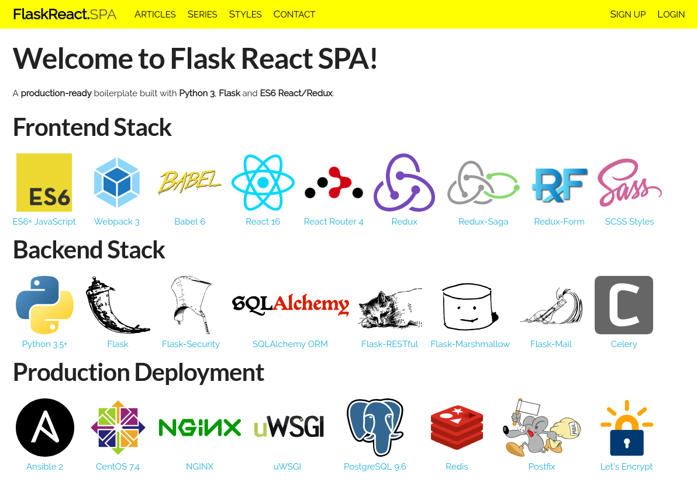

# Flask React SPA



## [React v16](https://facebook.github.io/react/) Frontend

The frontend is heavily inspired by [react boilerplate](https://github.com/react-boilerplate/react-boilerplate), and indeed borrows a good chunk of boilerplate from it (no pun intended).

- [React Router v4](https://reacttraining.com/react-router/web)
- [Redux](http://redux.js.org/), [Redux-Saga](https://redux-saga.js.org/) and [Redux-Form](https://redux-form.com) for handling state and side effects
- [Webpack 3](https://webpack.js.org/) and [Babel 6](https://babeljs.io/)
   - Hot Module Reloading
   - Tree Shaking
   - Code Splitting (asynchronous components via [react-loadable](https://github.com/thejameskyle/react-loadable))

## [Flask](http://flask.pocoo.org/) Backend

- [SQLAlchemy](http://docs.sqlalchemy.org/en/rel_1_1/) ORM with [Flask-SQLAlchemy](http://flask-sqlalchemy.pocoo.org/2.2/) and migrations provided by [Flask-Alembic](https://flask-alembic.readthedocs.io/en/stable/)
- RESTful APIs provided by a customized integration between [Flask-RESTful](http://flask-restful.readthedocs.io/en/latest/) and [Flask-Marshmallow](http://flask-marshmallow.readthedocs.io/en/latest/)
- [Flask-Security](https://flask-security.readthedocs.io/en/latest/) provides authentication, authorization, registration and change/forgot password functionality
   - User session management via [Flask-Login](https://flask-login.readthedocs.io/en/latest/)
   - User permissions and roles via [Flask-Principal](https://pythonhosted.org/Flask-Principal/)
   - Secrets encryption via [passlib](https://passlib.readthedocs.io/en/stable/) and [itsdangerous](https://pythonhosted.org/itsdangerous/)
   - CSRF protection via [Flask-WTF](https://flask-wtf.readthedocs.io/en/stable/)
- [Flask-Session](http://pythonhosted.org/Flask-Session/) for server-side sessions
- [Celery](http://www.celeryproject.org/) for asynchronous tasks, such as sending emails via [Flask-Mail](https://pythonhosted.org/Flask-Mail/)

## Ansible Production Deployment

- CentOS/RHEL 7.x
- Python 3.6 (provided by the [IUS Project](https://ius.io/))
- PostgreSQL 9.6
- Redis 3.2
- NGINX + uWSGI + supervisord
- Lets Encrypt HTTPS
- Email sending via Postfix with SSL and OpenDKIM

## Local Development QuickStart:

### Using docker-compose

Dependencies:

- `docker` and `docker-compose` (at least docker engine v1.13)

```bash
# install
$ git clone git@github.com:briancappello/flask-react-spa.git
$ cd flask-react-spa

# configure (the defaults are fine for development)
$ edit `backend/config.example.py` and save as `backend/config.py`
$ edit `frontend/app/config.example.js` and save as `frontend/app/config.js`

# run it
$ docker-compose up --build  # grab a coffee; bootstrapping takes a while the first time
```

Once it's done building and everything has booted up:

- Access the app at: [http://localhost:8888](http://localhost:8888)
- Access MailHog at: [http://localhost:8025](http://localhost:8025)
- Access the docs at: [http://localhost:5500](http://localhost:5500)
- Webpack Bundle Analyzer: [http://localhost:5555](http://localhost:5555)
- The API (eg for testing with CURL): [http://localhost:5000](http://localhost:5000)
- And last but not least, the database is exposed on port 5442

### Running locally (on Linux, *BSD, and probably OSX)

Dependencies:

- Python 3.5+
- Your virtualenv tool of choice (strongly recommended)
- PostgreSQL
- Redis (used for sessions persistence and the Celery tasks queue)
- node.js & npm (v6 or later recommended, only required for development)
- MailHog (not required, but it's awesome for testing email related tasks)

```bash
# install
$ git clone git@github.com:briancappello/flask-react-spa.git
$ cd flask-react-spa
$ mkvirtualenv -p /path/to/python3 flask_react_spa
$ pip install -r requirements.txt
$ npm install

# configure
$ edit `backend/config.example.py` and save as `backend/config.py`
$ edit `frontend/app/config.example.js` and save as `frontend/app/config.js`

# set up database
$ sudo -u postgres -i psql
postgres=# CREATE USER flask_api WITH PASSWORD 'flask_api';
postgres=# CREATE DATABASE flask_api;
postgres=# GRANT ALL PRIVILEGES ON DATABASE flask_api TO flask_api;
postgres=# \q  # (quit)

# run db migrations
$ python manage.py db upgrade

# load db fixtures (optional)
$ python manage.py db fixtures fixtures.json

# frontend dev server:
$ npm run start

# backend dev server:
$ python manage.py run

# backend celery workers:
$ python manage.py celery worker
$ python manage.py celery beat
```

## Full Documentation

Run `make docs` and browse to [http://localhost:5500](http://localhost:5500)

Sources are in the `/docs` folder.

FIXME: publish to GitHub Pages.

## License

MIT
